# Berlin Commute Area Tool

**Question it answers:** *"From where in Brandenburg can I get to Alexanderplatz by 09:00 on a weekday, with a total commute of 45 minutes or less?"*

It produces a **highlighted area on a map**: every place from which you can walk to a train station and take the train to Alexanderplatz within the time limit.

All the code is in `berlin_commute.py`. This document explains how it works, what it assumes, and how each role on the team would use it.

---

## 1. Demo settings

| Setting | Value | Constant in code |
|---|---|---|
| Destination | S+U Alexanderplatz (VBB stop `900100003`) | `ALEXANDERPLATZ_ID` |
| Arrive by (**Y**) | 09:00, next Tuesday (a normal weekday) | `ARRIVAL_HOUR`, `next_weekday_arrival()` |
| Max total commute (**X**) | 45 minutes (walk + train) | `MAX_COMMUTE_MIN` |
| Max walk to the station | 20 minutes | `MAX_WALK_MIN` |
| Walking speed | 83.3 m/min (≈ 5 km/h) | `WALKING_SPEED_MPM` |
| Starting points | Train stations in the State of Brandenburg (regional, S-Bahn, long-distance). Berlin stations are excluded. | `TRAIN_PRODUCTS`, `BRANDENBURG_OSM_ID` |

**The rule for each station:**

```
walk_minutes = min(20, 45 − train_minutes)
```

A station whose train takes 45 minutes or more contributes nothing. A station with a 30-minute train gets a 15-minute walking area. A station with a 20-minute train gets the full 20 minutes, because walking is capped.

---

## 2. How it works

The tool starts from the **stations**, not from every point on the map. Checking a grid of points across Brandenburg (about 30,000 km²) would take thousands of journey-planner requests. Checking stations takes only a few hundred.

```mermaid
flowchart LR
    A[1. Find train stations<br/>in Brandenburg<br/><i>OSM + VBB</i>] --> B[2. Train time per station<br/>to Alexanderplatz by 09:00<br/><i>VBB journey planner</i>]
    B --> C[3. Remaining walk time<br/>min&#40;20, 45 − train&#41;]
    C --> D[4. Walkable streets<br/>around each station<br/><i>OSMnx</i>]
    D --> E[5. Merge all areas<br/>= commute area]
    E --> F[GeoJSON + map]
```



1. **Find stations:** OpenStreetMap supplies station locations (`railway=station/halt`) inside the Brandenburg boundary. Each one is matched to its VBB stop ID, and only stops served by regional, S-Bahn or long-distance trains are kept.
2. **Train time:** one request per station to the VBB journey planner ([v6.vbb.transport.rest](https://v6.vbb.transport.rest)), asking for journeys that **arrive by 09:00**. The shortest one on time is kept. The journey may change to U-Bahn, tram or bus inside Berlin if that's what VBB suggests.
3. **Walking budget:** the rule from section 1.
4. **Walking area:** a small street network around each station is downloaded with OSMnx. The tool finds every street reachable on foot within the walking budget and draws each street as a 40 m wide band. The area therefore follows real streets and paths and doesn't spread over lakes, forests or motorways.
5. **Merge:** all station areas are combined into one shape, clipped to Brandenburg's border.

### Caching (why it's fast after the first run)

| Step | First run | Afterwards | Recomputed when… |
|---|---|---|---|
| 1. Stations | a few minutes | instant | never (unless `refresh=True`) |
| 2. Train times | a few minutes (one request per station) | instant | **Y** (arrival time) or the destination changes |
| 4. Walking networks | a few minutes (one small download per station) | instant | never (each cached network covers the full 20 minutes) |
| 3 + 5. Area | seconds | seconds | **X** changes |

So an **X slider in the UI can feel instant**. Only changing Y needs new requests to the API.

Everything is stored in `berlin_commute_cache/`.

---

## 3. Functions

| Function | What it does | Makes online requests? |
|---|---|---|
| `next_weekday_arrival(hour=9)` | The arrival time Y as a Berlin-time datetime (next Tuesday 09:00 by default) | No |
| `resolve_stop("Alexanderplatz")` | Looks up a VBB stop ID by name, to check it or change the destination | VBB |
| `get_journey(origin, destination, arrival)` | **Best single journey** arriving on time. Origin and destination can be a stop ID or `(lat, lng)` | VBB |
| `check_commute(lat, lng)` | "Can I commute from this exact spot?" Returns the journey plus `within_limit` | VBB |
| `get_brandenburg_boundary()` | Brandenburg outline as a polygon | OSM (once) |
| `get_brandenburg_stations()` | Table of train stations: `station_id, name, lat, lng, products` | OSM + VBB (once) |
| `precompute_station_times(stations, …)` | Adds `train_minutes, departure, arrival, transfers, lines` to the table | VBB (once per Y) |
| `station_walk_area(station_id, lat, lng, walk_minutes)` | Walking area of one station as a polygon | OSM (once per station) |
| `build_commute_area(station_times, max_commute_min=45)` | Returns `(station_areas, commute_area)` | No, if cached |
| `export_geojson(station_areas, commute_area)` | Writes GeoJSON files for the web app | No |
| `plot_commute_area(commute_area, station_times)` | Plotly preview map | No |
| `run_demo()` | Runs the whole pipeline with the demo settings | Yes, first time only |

---

## 4. Outputs

### Journey (`get_journey`, `check_commute`)

```json
{
  "duration_min": 38.0,
  "departure": "2026-10-06T08:20:00+02:00",
  "arrival":   "2026-10-06T08:58:00+02:00",
  "transfers": 1,
  "within_limit": true,
  "legs": [
    { "mode": "walking",  "line": null,  "from": "Custom location", "to": "Bernau Bhf",
      "departure": "...", "arrival": "...", "duration_min": 9.0, "distance_m": 700, "coordinates": [[52.68, 13.59], ...] },
    { "mode": "suburban", "line": "S2",  "from": "Bernau Bhf", "to": "Gesundbrunnen", ... },
    { "mode": "suburban", "line": "S41", "from": "Gesundbrunnen", "to": "S+U Alexanderplatz", ... }
  ]
}
```
*(The values above are illustrative, not real results.)*

- `mode` is one of `walking`, `suburban`, `regional`, `express`, `subway`, `tram`, `bus` or `ferry`.
- `coordinates` are `[lat, lng]` pairs, filled in only when `include_route=True`. `check_commute` always includes them.
- `within_limit` appears only in `check_commute`.

### Commute area (GeoJSON, in `berlin_commute_cache/`)

- `commute_area_45min.geojson`: one merged (Multi)Polygon with properties `max_commute_min` and `arrival`.
- `station_areas_45min.geojson`: one polygon per station with `station_id`, `name`, `train_minutes` and `walk_minutes`. Useful for tooltips like *"Bernau: 26 min by train + up to 19 min walk."*

Both use standard WGS84 coordinates (EPSG:4326) and load directly into Mapbox, Leaflet, deck.gl or Google Maps data layers.

---

## 5. How each role uses it

### Software developer
- **Setup:** Python 3.9+. Install with `pip install osmnx geopandas networkx pandas plotly requests shapely scikit-learn`. Plotly ≥ 5.24 is needed for `Scattermap`, and scikit-learn is needed by OSMnx for nearest-node lookups.
- **Before serving:** run `python berlin_commute.py` once to fill the cache (takes several minutes). The web app should then **serve the cached GeoJSON files** rather than computing on each request.
- **What's fast enough for live requests:**
  - `build_commute_area(..., max_commute_min=X)` for a new X (seconds, all local).
  - `check_commute(lat, lng)` for a single address (one VBB request).
- **Arrival time:** the tool expects timezone-aware datetimes in `Europe/Berlin`. `next_weekday_arrival()` builds one.
- **VBB API limits:** the public API is community-run, with no guaranteed uptime and a limit of about 100 requests per minute. The code pauses between calls and retries rate-limit and server errors. That's fine for a demo. **For production, switch `VBB_API_URL`** to your own instance or to VBB's official API.

### UX designer
- **What the user controls:**
  - **Max commute (X):** a slider, e.g. 15–90 min. Changes are instant.
  - **Arrive by (Y):** a time picker. Changes are slow (minutes) unless a few Y values are computed in advance, e.g. 07:00, 08:00, 09:00 and 10:00.
- **What to show:**
  - one shaded area (`commute_area`);
  - optionally, station areas shaded by train time, since the station GeoJSON has `train_minutes`;
  - station pins and an Alexanderplatz pin.
- **Point check:** when the user drops a pin or types an address, `check_commute` returns the journey step by step (walk → S2 → S41) with route lines. That's the natural input for the AI concierge's answer.
- **Empty state:** if X is very small, no station qualifies and `commute_area` is `None`. Show a "no area within X minutes, try a longer commute" message.
- **Expect small differences:** the shaded area only counts *walking* to a train station, while the point check can also use buses. A pin just outside the area may therefore still show a valid commute. The copy should make this clear, e.g. "area reachable on foot + train."

### Data scientist
- **Where the key numbers are:**
  - `station_times_*.csv` has one row per station with train minutes, transfers and lines. Good for distributions and rankings, e.g. "fastest-connected towns."
  - `station_areas` (a GeoDataFrame) can be joined with population, rent or land-use data to estimate, for example, how many people live within 45 minutes.
- **Parameters to experiment with:** `MAX_WALK_MIN`, `WALKING_SPEED_MPM`, `EDGE_BUFFER_M`, `TRAIN_PRODUCTS`, and the arrival time.
- **Things to watch for in analysis:**
  - Train time is measured from **departure at the station to arrival at Alexanderplatz**. It doesn't include waiting at home or at Alexanderplatz.
  - Only one best journey per station at one arrival time is used. Train frequency and variation between departures aren't captured. Computing several Y values and taking the median would make it more robust.
  - Areas count walking only, so they are **conservative**. People who cycle, drive or take a bus to the station can live further out.
  - Street-network walking uses the full street graph. The 40 m band slightly overstates the area along long streets.
  - Public holidays aren't checked when choosing "next Tuesday."

---

## 6. Limitations and possible next steps

| Limitation | Possible extension |
|---|---|
| Access to the station is walking only | Add bike access: `network_type="bike"` with about 250 m/min, reusing the same pipeline |
| Buses and trams aren't starting points | Add `"bus"`/`"tram"` to `TRAIN_PRODUCTS`. This means many more stops and API calls. |
| Only one arrival time | Precompute several Y values and let the UI switch between cached results |
| Brandenburg only | Remove the boundary filter to include Berlin's outer districts |
| Public API with no guarantees | Self-host `hafas-rest-api` or OpenTripPlanner with the VBB GTFS feed |
| Single destination | Make `destination` a parameter in the UI; the station cache is already per destination |

---

## 7. Data sources and credits
- **Timetables and journeys:** VBB (Verkehrsverbund Berlin-Brandenburg), via [v6.vbb.transport.rest](https://v6.vbb.transport.rest).
- **Streets, stations and boundaries:** © OpenStreetMap contributors (ODbL), via [OSMnx](https://osmnx.readthedocs.io). A published web app must show OSM attribution on the map.
